# ESP32 Arduino Lib Builder

This repository contains the scripts that produce the SDK included with esp32-arduino. It not only supports local compilation but also provides an automated compilation and SDK download process through GitHub Actions.

If you want to directly use the precompiled SDK based on the branches below, please check the [arduino-esp32-SDK](https://github.com/esp-arduino-libs/arduino-esp32-sdk) repository.

## Contents

- [ESP32 Arduino Lib Builder](#esp32-arduino-lib-builder)
  - [Contents](#contents)
  - [Feature](#feature)
  - [Branches](#branches)
    - [Release Versions](#release-versions)
    - [Debug Versions](#debug-versions)
    - [High Performance Versions](#high-performance-versions)
  - [How to Use](#how-to-use)
    - [Compilation in Github](#compilation-in-github)
    - [Compilation in Local](#compilation-in-local)

## Feature

In comparison to the original [esp32-arduino-lib-builder](https://github.com/espressif/esp32-arduino-lib-builder), this repository is used for recompiling specific versions of the SDK in `arduino-esp32` and has the following branches:

* `release/*` is used to recompile the original SDK for a specified version.
* `debug/*` is used to recompile debug versions based on a specified SDK version.
* `high_perf/*` is used to recompile high performance versions based on a specified SDK version. It changes some configurations (as below) and can achieve higher performance in some cases, especially for avoiding [screen drifting](https://docs.espressif.com/projects/esp-faq/en/latest/software-framework/peripherals/lcd.html#why-do-i-get-drift-overall-drift-of-the-display-when-esp32-s3-is-driving-an-rgb-lcd-screen) when using RGB LCDs.

  * For ESP32-S3 SoCs:
    * It changes the optimization level from `-Os` to `-O2` by enabling `CONFIG_COMPILER_OPTIMIZATION_PERF=y`.
    * It increases the size of the data cache line from `32` to `64` by enabling `CONFIG_ESP32S3_DATA_CACHE_LINE_64B=y`.
  * For ESP32-S3R8 SoC:
    * It enables the function **XIP on PSRAM** by enabling `CONFIG_SPIRAM_FETCH_INSTRUCTIONS=y` and `CONFIG_SPIRAM_RODATA=y`.

## Branches

### Release Versions

* [release/v2.0.13](https://github.com/esp-arduino-libs/esp32-arduino-lib-builder/tree/release/v2.0.13)
* [release/v3.0.0-alpha3](https://github.com/esp-arduino-libs/esp32-arduino-lib-builder/tree/release/v3.0.0-alpha3)

### Debug Versions

* [debug/v2.0.13](https://github.com/esp-arduino-libs/esp32-arduino-lib-builder/tree/release/v2.0.13)
* [debug/v3.0.0-alpha3](https://github.com/esp-arduino-libs/esp32-arduino-lib-builder/tree/release/v3.0.0-alpha3)

### High Performance Versions

* [high_perf/v3.0.0-alpha3](https://github.com/esp-arduino-libs/esp32-arduino-lib-builder/tree/high_perf/v3.0.0-alpha3)

## How to Use

### Compilation in Github

1. Click `Fork` to fork this repository into your account.

  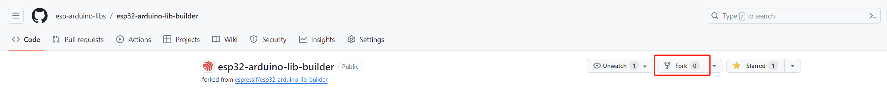

2. Uncheck the `Copy the master branch only` option and click `Create fork`.

  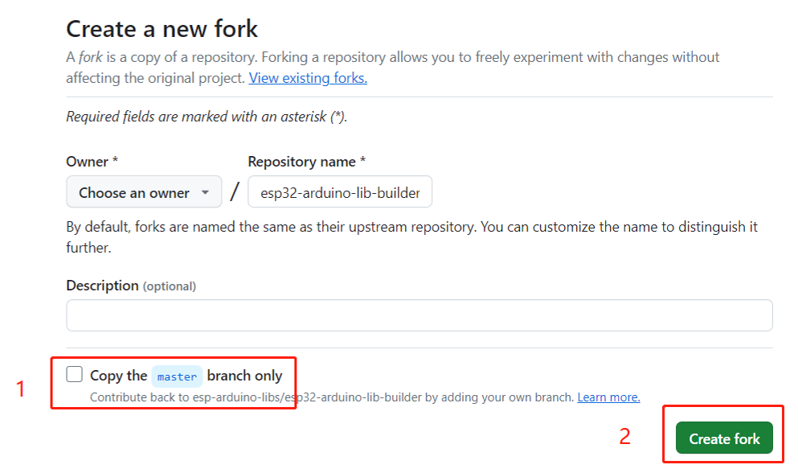

3. If you want to change the default configurations, follow the below steps:

  * Choose a branch based on the version you want to recompile. Here take `release/v3.0.0-alpha3` as an example.

    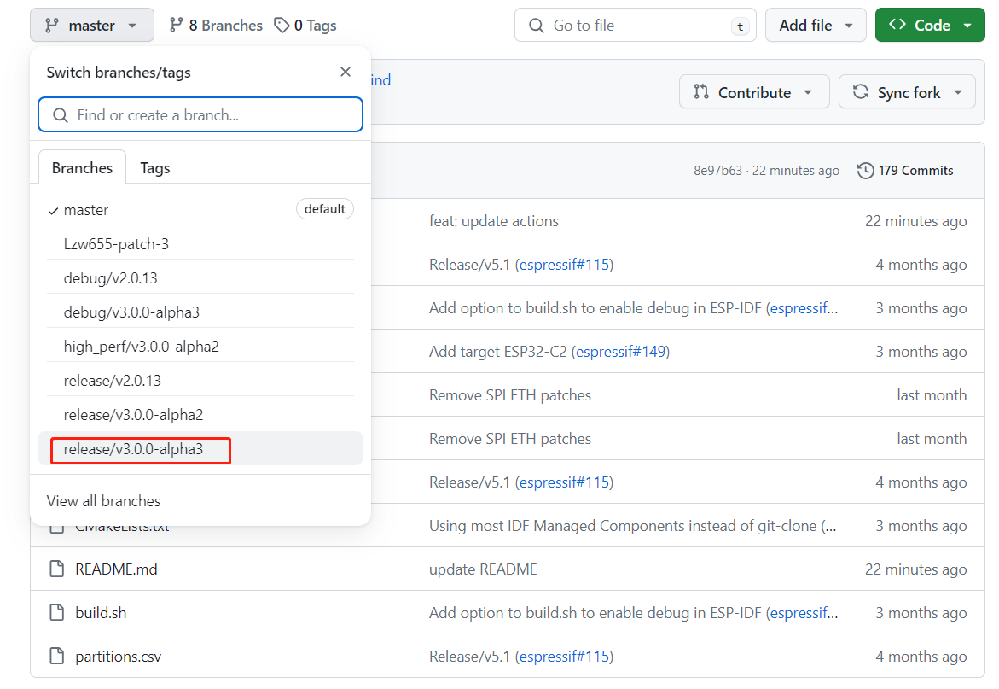

  * To change the default configurations, mofify the files in the `configs` folder based on your application requirements.

    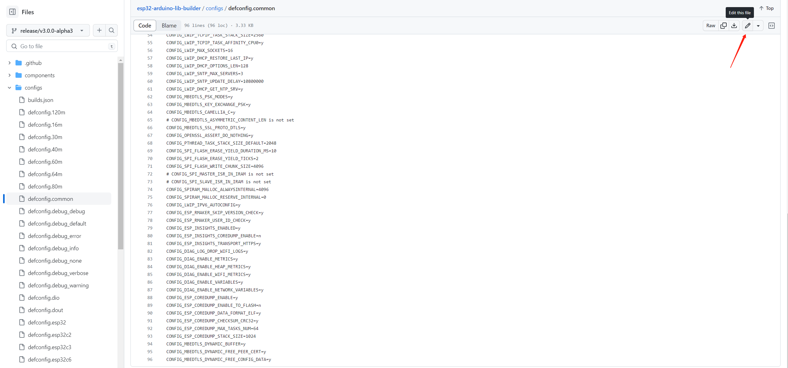

  * Commit the changes.

    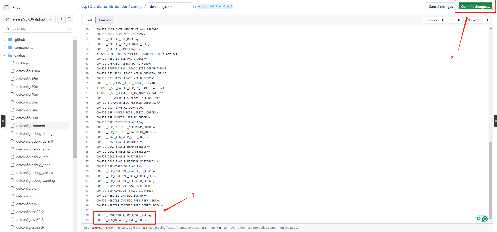

  * Select `Create a new branch for this commit and start a pull request`, change the branch name if needed and click `Propose changes`.

    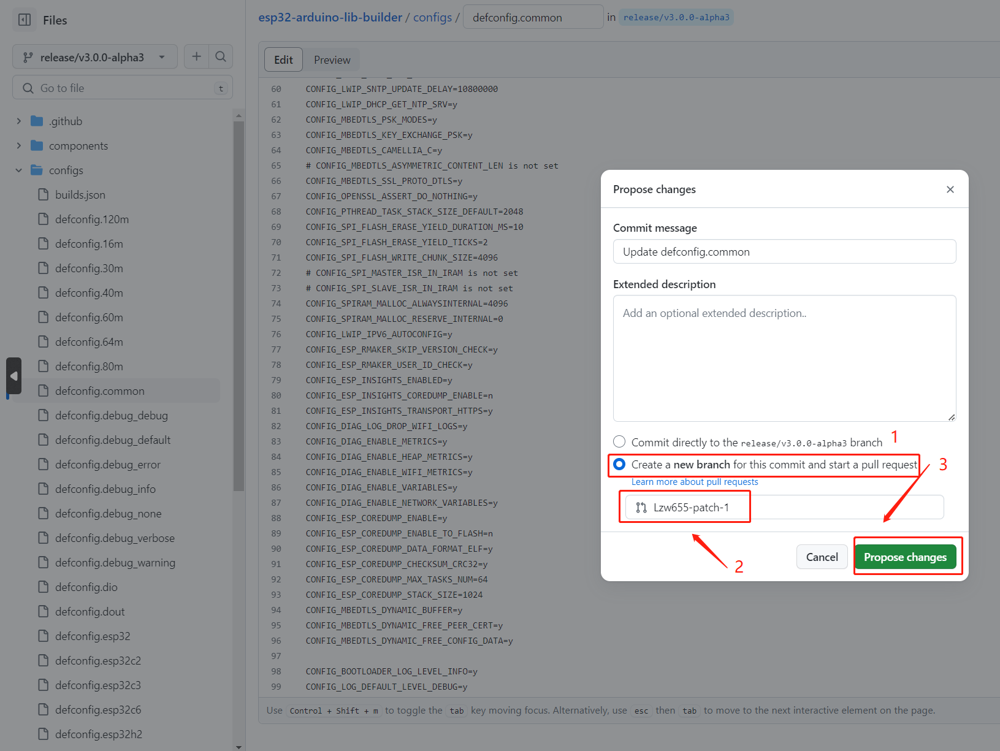

  * Do not create a pull request, just click `Action`. Here you can see the compilation process. (Default to compile all targets)

    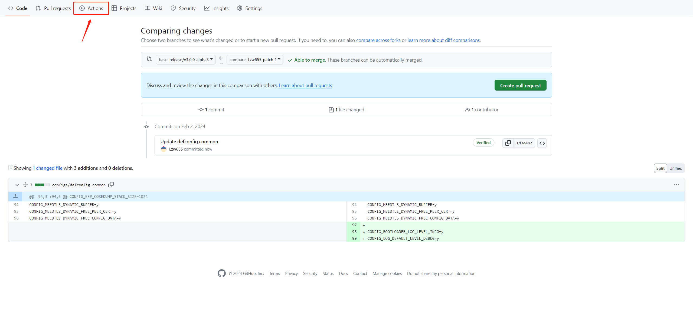

    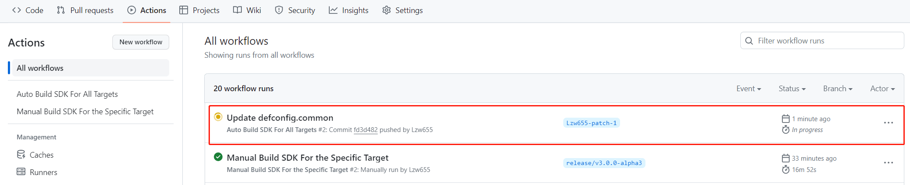

4. If you don't need to change the default configurations or just want to compile a specific target, follow the below steps:

  * Click `Actions` and enter the `Manual Build SDK For the Specific Target` workflow.

    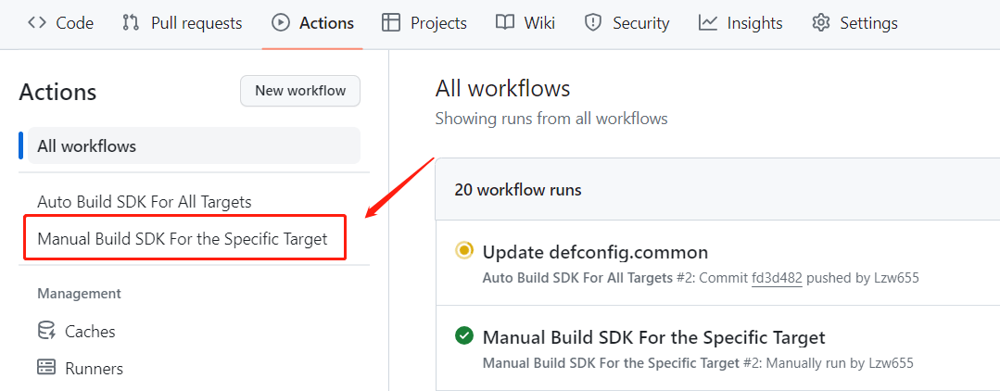

  * Click `Run workflow`, select the branch and the target, click `Run workflow`. Then the compilation process will start.

    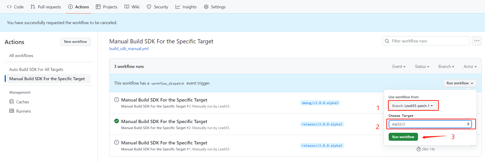

    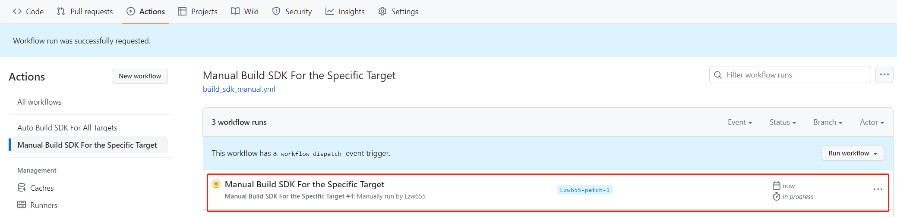

5. After the compilation is complete, download the zip file from the `Artifacts`.

  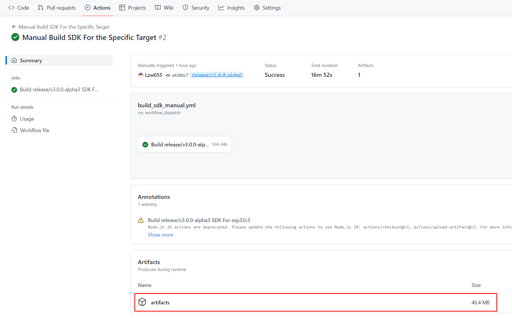

6. To replace the original SDK, please refer to the [steps](https://github.com/esp-arduino-libs/arduino-esp32-sdk#how-to-use) for more details.

### Compilation in Local

1. Choose a branch version based on your application requirements and download it to the local.
2. Modify the files in the `configs` folder based on your application requirements.
3. Consult its README for compilation instructions. Note that the process involves downloading `ESP-IDF`, `arduino-esp32`, and several large components, which may take a considerable amount of time. Please be patient.
6. After the compilation is complete, the SDK will be located in the `out` folder.
7. To replace the original SDK, please refer to the [steps](https://github.com/esp-arduino-libs/arduino-esp32-sdk#how-to-use) for more details.
